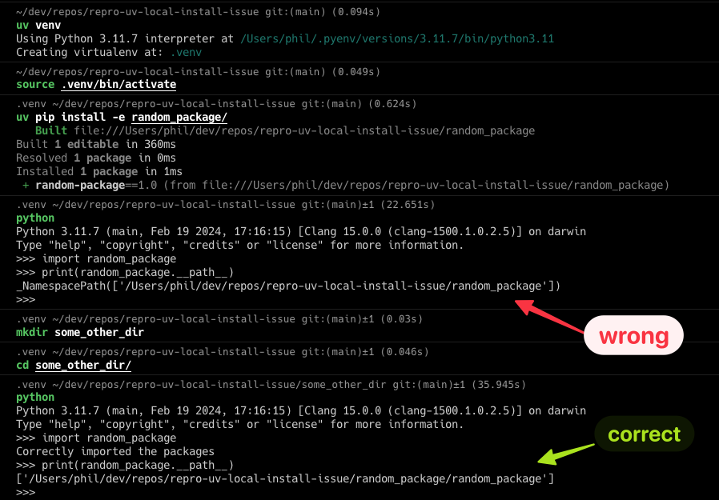

# UV editable install issue

This repo aims to reproduce an issue with the UV editable install.

### Steps to reproduce

```
uv venv
uv pip install -e random_package
python -c "import random_package; print(random_package.__path__)" # ❌ prints a namespace path to ./random_package
mkdir some_other_dir
cd some_other_dir
python -c "import random_package; print(random_package.__path__)" # ✅ prints correct path to ./random_package/random_package
```

### Screenshot


